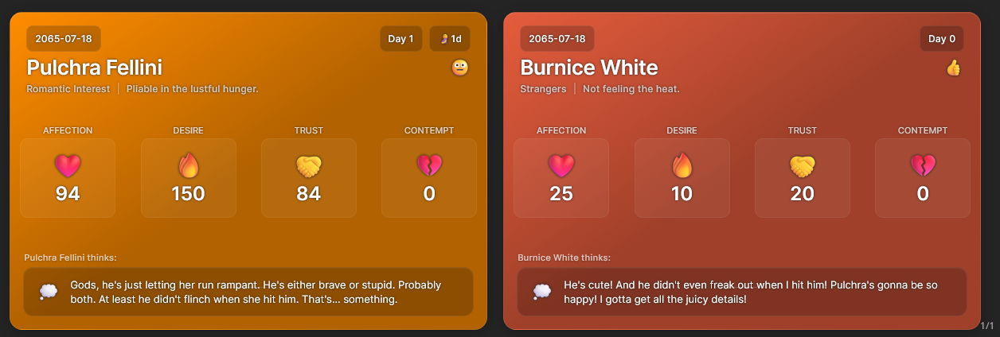
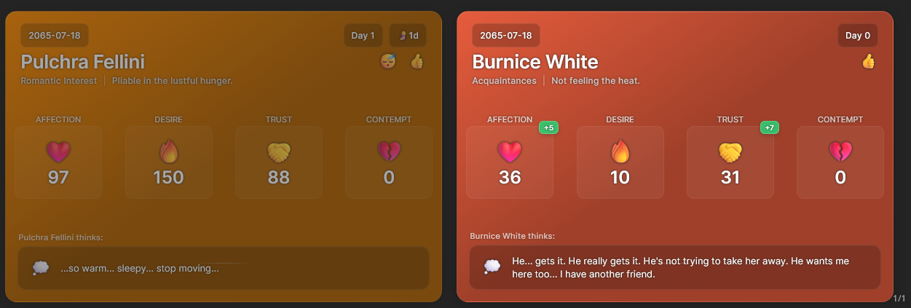

# Silly Sim Tracker

A powerful SillyTavern extension that dynamically renders visually appealing tracker cards based on JSON data embedded in character messages. Perfect for dating sims, RPGs, or any scenario where you need to track character stats, relationships, and story progression.



## Installation

1. **Copy the Extension Link**
   - Copy the repo URL (`https://github.com/prolix-oc/SillyTavern-SimTracker`) and keep it in your clipboard

2. **Install in SillyTavern**
   - Open the extensions menu (3 stacked cubes)
   - Click on "Install Extension"
   - Paste URL into repo URL field. OPTIONALLY: select a branch or version of the extension
   - Choose install scope (either for you or globally)

3. **Verify Installation**
   - The extension should now appear in your SillyTavern settings
   - You can access the configuration panel through the Extensions drawer

## Features

### Core Functionality
- **Dynamic Tracker Cards**: Automatically generates beautiful, responsive tracker cards from JSON data in character messages
- **Flexible Data Structure**: Supports both simple and complex data formats with automatic migration tools
- **Real-time Rendering**: Cards update instantly as new messages are received
- **Multi-Character Support**: Display stats for multiple characters in a single message

### Customization Options
- **Customizable Templates**: Choose from built-in templates or create your own custom HTML templates
- **Custom Emoji Icons**: Override default icons for any field by specifying custom emojis in your JSON data
- **Flexible Styling**: Adjust colors, layouts, and visual elements to match your preferences
- **Configurable Code Blocks**: Set your own identifier for sim data blocks (default: "sim")  
- **Thought Bubble Display**: Toggle visibility of character internal thoughts
- **Card Color Customization**: Set default background colors with automatic dark variants

### Advanced Features
- **JSON Format Migration**: Convert legacy data formats to the improved structure with one click
- **Slash Command Support**: Use `/sst-convert` to migrate all data in the current chat
- **Macro Integration**: Includes `{{sim_tracker}}` and `{{last_sim_stats}}` macros for prompt engineering
- **Data Hiding**: Option to hide raw JSON code blocks while keeping the visual cards
- **Custom Fields Definition**: Define your own data fields for use in templates and prompts
- **YAML/JSON Format Switching**: Choose between JSON, YAML, or auto-detect formats for your tracker blocks with intelligent format recognition
- **Data Synchronization**: Automatically synchronize character data to persistent app-data variables when enabled per character, supporting both direct value assignments and incremental changes, with automatic backfill of missing values

### Template System
- **Handlebars.js Templates**: Powerful templating engine for creating rich, dynamic cards
- **Built-in Helpers**: Custom helpers like `eq` and `gt` for conditional logic in templates
- **Responsive Design**: Cards automatically adapt to mobile and desktop layouts
- **Visual Indicators**: Color-coded change indicators for stat modifications
- **Status Icons**: Automatic emoji-based status indicators for health, reactions, and inactivity
- **Positionable Templates**: Templates can define their display position (Above, Bottom, Left, Right, or Macro replacement)
- **Multiple Built-in Templates**: Choose from different designs including sleek sidebar templates and tabbed interfaces
- **Tabbed Interface**: Navigate between multiple character cards using tabs with smooth slide animations

### Data Structure
Supports both legacy and modern JSON formats:

**Legacy Format**:
```json
{
  "current_date": "2025-08-10",
  "current_time": "14:30",
  "Alice": {
    "ap": 75,
    "dp": 60,
    "tp": 80,
    "cp": 20
  }
}
```

**Modern Format** (recommended):
```json
{
  "worldData": {
    "current_date": "2025-08-10",
    "current_time": "14:30"
  },
  "cards": [
    {
      "name": "Alice",
      "ap": 75,
      "dp": 60,
      "tp": 80,
      "cp": 20
    }
  ]
}
```

**YAML Format** (alternative):
```yaml
worldData:
  current_date: "2025-08-10"
  current_time: "14:30"
cards:
  - name: "Alice"
    ap: 75
    dp: 60
    tp: 80
    cp: 20
```

### Custom Icons

The extension supports custom emoji icons for any field in your JSON data. You can specify custom icons using several formats:

**Format 1: Field + "Icon"**
```yaml
worldData:
  current_date: "2025-08-10"
  current_time: "14:30"
cards:
  - name: "Alice"
    ap: 75
    apIcon: 💖
    dp: 60
    dpIcon: 🌸
    energy: 80
    energyIcon: ⚡
```

**Format 2: Icons Object**
```yaml
worldData:
  current_date: "2025-08-10"
  current_time: "14:30"  
cards:
  - name: "Alice"
    ap: 75
    dp: 60
    energy: 80
    icons:
      ap: 💖
      dp: 🌸
      energy: ⚡
```

**Format 3: Other Naming Conventions**
```yaml
cards:
  - name: "Alice"
    ap: 75
    ap_icon: 💖        # underscore format
    dp: 60
    icon_dp: 🌸        # prefix format
```

**Format 4: Shared World-Level Icons**
```yaml
worldData:
  current_date: "2025-08-10"
  current_time: "14:30"
  icons:
    ap: 💖
    dp: 🌸
    energy: ⚡
    trust: 🤝
cards:
  - name: "Alice"
    ap: 75
    dp: 60
    energy: 80
    trust: 90
  - name: "Bob"
    ap: 30
    dp: 45
    energy: 70
    trust: 85
```

Custom icons override the default icons for any field, allowing you to personalize your tracker cards with any emoji you prefer. 

**Icon Priority Order:**
1. Character-specific `icons` object (highest priority)
2. World-level `icons` object (shared across all characters)
3. Character-specific field+Icon naming (e.g., `apIcon`, `ap_icon`)
4. Default pattern-based icons (lowest priority)

This system allows you to define shared icons in `worldData.icons` that apply to all characters, while still allowing individual characters to override specific icons if needed. If no custom icon is specified, the extension will use its intelligent pattern-matching system to assign appropriate default icons based on the field name.

## Usage Examples

### Single Character Card


### Multi-Character Cards


### Inactive Character Display


## Configuration

The extension offers extensive configuration options through the SillyTavern settings panel:

1. **Enable/Disable**: Master switch to turn the extension on or off
2. **Code Block Identifier**: Customize the keyword used to identify sim data blocks
3. **Default Card Color**: Set the background color for cards
4. **Thought Bubble Visibility**: Toggle display of character thoughts
5. **Template Selection**: Choose from built-in templates or load custom ones
6. **Template Position**: Choose where cards should be displayed (can be overridden by templates)
7. **Custom Fields**: Define your own data fields for tracking
8. **Tracker Format**: Choose between JSON, YAML, or auto-detect for parsing tracker blocks
9. **Data Hiding**: Hide raw JSON code blocks from chat display
10. **System Prompt**: Customize the base prompt for sim tracking

### Default Settings

For first-time users, the extension comes with a comprehensive set of default settings:

- **Code Block Identifier**: "sim"
- **Default Card Color**: #6a5acd (a pleasant purple)
- **Template**: Dating Sim Tracker (built-in)
- **Default Fields**: A rich set of fields for tracking character relationships including:
  - Affection Points (AP)
  - Desire Points (DP)
  - Trust Points (TP)
  - Contempt Points (CP)
  - Change tracking for each stat
  - Relationship and desire status text
  - Pregnancy tracking
  - Health status
  - Background color customization
  - Reaction tracking
  - Internal thoughts
  - Day counter
  - Inactivity tracking with reasons

These defaults provide a solid foundation for most dating sim scenarios, but can be fully customized to suit your specific needs.

### Template Positioning

Templates can define their preferred position using HTML comments. The positioning options are:

- **ABOVE**: Display the tracker above the message content (inside the message block)
- **BOTTOM**: Display the tracker below the message content (default)
- **LEFT**: Display the tracker in a fixed sidebar on the left side of the screen
- **RIGHT**: Display the tracker in a fixed sidebar on the right side of the screen
- **MACRO**: Replace a specific macro (`{{sim_tracker_positioned}}`) in the message content

To set a position in your template, add a comment like this at the top of your template file:
```html
<!-- POSITION: LEFT -->
```

If no position is specified in the template, the extension will use the position selected in the settings panel.

The LEFT and RIGHT positioning options now use a vertically-stretched container that centers the tracker cards vertically while maintaining their natural width, providing a more consistent and visually appealing layout.

### Positioning Examples

1. **ABOVE Positioning**: The tracker will appear at the top of the message block, above the reasoning details.
2. **MACRO Positioning**: The tracker will replace the `{{sim_tracker_positioned}}` macro wherever it appears in your message.

These positioning options give you fine-grained control over where your tracker cards appear in relation to your messages.

### Built-in Templates

The extension includes several built-in templates for different use cases:

1. **Default Template**: A clean, responsive design that works well in most situations
2. **Sidebar Templates**: Sleek designs optimized for display in sidebars with progress bars and glass-morphism effects
   - **Right Sidebar**: Positioned on the right side of the screen
   - **Left Sidebar**: Positioned on the left side of the screen
3. **Tabbed Interface Templates**: Alternative sidebar designs with tabbed navigation for multiple characters
   - **Right Sidebar with Tabs**: Tabbed interface on the right side of the screen
   - **Left Sidebar with Tabs**: Tabbed interface on the left side of the screen
4. **Positionable Template**: A template that demonstrates the macro positioning feature

To use a built-in template, simply select it from the template selection dropdown in the settings panel.

## Template Preset Import/Export

The extension now supports importing and exporting template presets, making it easy to share your custom tracker setups with others or back up your configurations.

### Exporting a Preset

1. Configure your template and settings as desired
2. In the extension settings panel, click the "Export Preset" button
3. In the export dialog, you can:
   - Set a name and author for your template
   - Choose the template position
   - Select which components to include (System Prompt, Custom Fields, Extension Settings)
4. Click "Export" to download a JSON file containing your preset
5. The preset is also saved locally for future use

### Importing a Preset

1. Obtain a preset JSON file (either one you exported or one shared by another user)
2. In the extension settings panel, click the "Import Preset" button
3. Select the preset JSON file from your computer
4. The extension will automatically apply all settings from the preset
5. The preset is also saved locally for future use

### Managing Presets

1. In the extension settings panel, click the "Manage Presets" button
2. In the modal that appears, you can:
   - See a list of all your saved presets
   - Apply any preset with the "Apply" button
   - Delete any preset with the "Delete" button

This feature allows for easy sharing of custom tracker designs and configurations within the community, as well as convenient management of your own templates.

## Migration Tools

To help users transition to the improved JSON format:

1. **Settings Button**: Use the "Migrate to New Format" button in the settings panel
2. **Slash Command**: Type `/sst-convert` in any chat to migrate all data in that chat
3. **Automatic Compatibility**: Both old and new formats are supported seamlessly

## Slash Commands

### /sst-convert
Converts all sim data in the current chat from the old format to the new format.

**Usage:**
- `/sst-convert` - Converts all sim data to the new format using current settings
- `/sst-convert json` - Converts all sim data to JSON format
- `/sst-convert yaml` - Converts all sim data to YAML format
- `/sst-convert auto` - Sets format to auto-detect and migrates all sim data

### /sst-add
Adds a sim block to the last character message if it doesn't already have one, and requests continuation.

**Usage:**
- `/sst-add` - Adds a sim block in the user's preferred format (JSON, YAML, or auto-detect with JSON default)

## Additional Documentation

- **[Data Synchronization](XCHANGE_FEATURE.md)**: Detailed guide on the persistent data tracking feature

---
